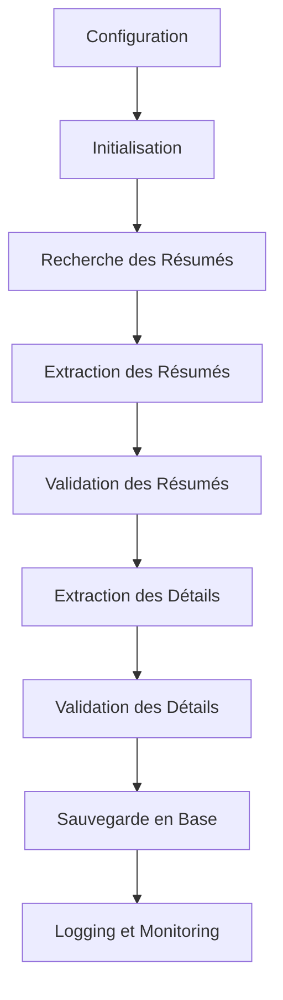

# 🏗️ Architecture du Pipeline d'Extraction

> **Architecture modulaire et maintenable pour l'extraction de données immobilières**

## 🎯 **Vue d'Ensemble de l'Architecture**

Le pipeline suit une architecture **modulaire et asynchrone** conçue pour la **maintenabilité** et la **scalabilité**. Chaque composant a une responsabilité unique et peut être testé et modifié indépendamment.

## 🏗️ **Structure Modulaire**

### **Organisation des Composants**

```
src/
├── 🎭 core/                    # Pipeline principal
│   └── pipeline.py            # Orchestrateur principal
├── 🔍 extractors/             # Extracteurs spécialisés
│   ├── centris_extractor.py   # Interface principale Centris
│   └── centris/               # Implémentation Centris modulaire
│       ├── session_manager.py      # Gestion des sessions HTTP
│       ├── search_manager.py       # Recherche et pagination
│       ├── summary_extractor.py    # Extraction des résumés
│       ├── detail_extractor.py     # Extraction des détails
│       └── data_validator.py       # Validation des données
├── 📊 models/                 # Modèles de données Pydantic
├── 🗄️ services/              # Services (base de données)
└── 🛠️ utils/                 # Utilitaires et validation
```

### **Séparation des Responsabilités**

| Composant            | Responsabilité                            | Dépendances                       |
| -------------------- | ----------------------------------------- | --------------------------------- |
| **SessionManager**   | Gestion des sessions HTTP, cookies, retry | `aiohttp`, `structlog`            |
| **SearchManager**    | Construction des requêtes, pagination     | `SessionManager`                  |
| **SummaryExtractor** | Extraction des résumés de propriétés      | `BeautifulSoup`, `SessionManager` |
| **DetailExtractor**  | Extraction des détails complets           | `BeautifulSoup`, `SessionManager` |
| **DataValidator**    | Validation et nettoyage des données       | `Pydantic`, `validators`          |
| **CentrisExtractor** | Orchestration et coordination             | Tous les composants               |

## 🔄 **Flux de Données**

### **Workflow d'Extraction**



### **Séquence d'Exécution**

1. **🔧 Initialisation**

   - Chargement de la configuration
   - Création des composants
   - Connexion à la base de données

2. **🔍 Recherche**

   - Construction de la requête de recherche
   - Appel à l'API Centris
   - Gestion de la pagination

3. **📊 Extraction des Résumés**

   - Parsing du HTML des pages de résultats
   - Extraction des informations de base
   - Validation et nettoyage

4. **🏠 Extraction des Détails**

   - Récupération des pages individuelles
   - Extraction des informations détaillées
   - Validation complète des données

5. **💾 Sauvegarde**
   - Validation finale des modèles
   - Sauvegarde en MongoDB
   - Logging des résultats

## 🧩 **Composants Détaillés**

### **1. SessionManager (`session_manager.py`)**

**Responsabilité** : Gestion des sessions HTTP avec gestion des erreurs et retry.

```python
class CentrisSessionManager:
    async def get(self, url: str) -> Response
    async def post(self, url: str, data: dict) -> Response
    async def close(self)
```

**Fonctionnalités** :

- ✅ Gestion automatique des cookies
- ✅ Retry avec backoff exponentiel
- ✅ Gestion des timeouts
- ✅ Rotation des User-Agents
- ✅ Gestion des erreurs réseau

### **2. SearchManager (`search_manager.py`)**

**Responsabilité** : Construction des requêtes de recherche et gestion de la pagination.

```python
class CentrisSearchManager:
    async def search_properties(self, query: SearchQuery) -> List[PropertySummary]
    async def _get_search_page(self, page: int) -> BeautifulSoup
    async def _extract_summaries_from_page(self, soup: BeautifulSoup) -> List[PropertySummary]
```

**Fonctionnalités** :

- ✅ Construction des requêtes Centris
- ✅ Gestion automatique de la pagination
- ✅ Extraction des résumés de propriétés
- ✅ Gestion des erreurs de pagination

### **3. SummaryExtractor (`summary_extractor.py`)**

**Responsabilité** : Extraction des informations de base depuis les pages de résultats.

```python
class CentrisSummaryExtractor:
    def extract_summaries_from_html(self, html: str) -> List[PropertySummary]
    def _extract_property_summary(self, property_elem: Tag) -> PropertySummary
```

**Fonctionnalités** :

- ✅ Parsing HTML avec BeautifulSoup
- ✅ Extraction des informations de base
- ✅ Validation des données extraites
- ✅ Gestion des données manquantes

### **4. DetailExtractor (`detail_extractor.py`)**

**Responsabilité** : Extraction des informations détaillées depuis les pages individuelles.

```python
class CentrisDetailExtractor:
    def extract_property_details(self, soup: BeautifulSoup, url: str) -> Property
    def _extract_address(self, soup: BeautifulSoup) -> Address
    def _extract_financial(self, soup: BeautifulSoup) -> FinancialInfo
    # ... autres méthodes d'extraction
```

**Fonctionnalités** :

- ✅ Extraction des adresses et coordonnées GPS
- ✅ Extraction des informations financières
- ✅ Extraction des caractéristiques techniques
- ✅ Extraction des médias (images, visites virtuelles)
- ✅ **Nouvelles informations détaillées** : Utilisation, style bâtiment, stationnement, unités, Walk Score

### **5. DataValidator (`data_validator.py`)**

**Responsabilité** : Validation et nettoyage des données extraites.

```python
class CentrisDataValidator:
    def validate_search_results(self, summaries: List[PropertySummary]) -> List[PropertySummary]
    def _validate_locations_searched(self, summaries: List[PropertySummary]) -> List[PropertySummary]
    def _validate_property_types(self, summaries: List[PropertySummary]) -> List[PropertySummary]
    def _validate_regions(self, summaries: List[PropertySummary]) -> List[PropertySummary]
    def _validate_postal_codes(self, summaries: List[PropertySummary]) -> List[PropertySummary]
    def _validate_prices(self, summaries: List[PropertySummary]) -> List[PropertySummary]
    def _validate_gps_coordinates(self, summaries: List[PropertySummary]) -> List[PropertySummary]
    def _validate_property_ids(self, summaries: List[PropertySummary]) -> List[PropertySummary]
    def _clean_text(self, text: str) -> str
```

**Fonctionnalités** :

- ✅ Validation des emplacements recherchés
- ✅ Validation des types de propriétés
- ✅ Validation des régions et codes postaux
- ✅ Validation des prix et coordonnées GPS
- ✅ Nettoyage et normalisation des textes
- ✅ **Nouvelle validation** : Cohérence type/catégorie

### **6. CentrisExtractor (`centris_extractor.py`)**

**Responsabilité** : Orchestration et coordination de tous les composants.

```python
class CentrisExtractor:
    async def extract_summaries(self, search_query: SearchQuery) -> List[PropertySummary]
    async def extract_details(self, property_id: str) -> Optional[Property]
    async def close(self)
```

**Fonctionnalités** :

- ✅ Coordination des composants
- ✅ Gestion du cycle de vie des composants
- ✅ Interface unifiée pour l'extraction
- ✅ Gestion des erreurs globales

## 🔧 **Gestion des Erreurs et Résilience**

### **Stratégies de Récupération**

1. **Retry Automatique** : Tentatives multiples avec délai progressif
2. **Fallback** : Sélecteurs HTML alternatifs en cas d'échec
3. **Graceful Degradation** : Continuation avec données partielles
4. **Logging Détaillé** : Traçabilité complète des erreurs

### **Types d'Erreurs Gérées**

- ✅ **Erreurs réseau** : Timeouts, connexions refusées
- ✅ **Erreurs HTML** : Structure modifiée, sélecteurs cassés
- ✅ **Erreurs de validation** : Données manquantes ou invalides
- ✅ **Erreurs de base de données** : Connexions, permissions

## 📊 **Performance et Scalabilité**

### **Optimisations Implémentées**

- **Concurrence asynchrone** : Gestion de multiples requêtes simultanées
- **Pool de workers** : Limitation du nombre de connexions concurrentes
- **Cache des sessions** : Réutilisation des connexions HTTP
- **Validation en streaming** : Traitement des données au fur et à mesure

### **Métriques de Performance**

- **Débit** : 8-20 propriétés par page de résultats
- **Latence** : 1-2 secondes par page
- **Concurrence** : Jusqu'à 4 workers simultanés
- **Mémoire** : Gestion optimisée des objets HTML

## 🧪 **Testabilité**

### **Architecture Orientée Tests**

- **Injection de dépendances** : Composants facilement mockables
- **Interfaces claires** : Contrats bien définis entre composants
- **Séparation des responsabilités** : Tests unitaires ciblés
- **Configuration externalisée** : Tests avec différents paramètres

### **Types de Tests Supportés**

- **Tests unitaires** : Validation des composants individuels
- **Tests d'intégration** : Validation des interactions entre composants
- **Tests d'extraction réelle** : Validation sur Centris en production
- **Tests de performance** : Validation des métriques de performance

## 🔄 **Évolutivité et Maintenance**

### **Ajout de Nouveaux Champs**

1. **Extension du modèle** : Ajout des champs dans `Property`
2. **Implémentation de l'extraction** : Nouvelle méthode dans `DetailExtractor`
3. **Validation** : Règles dans `DataValidator`
4. **Tests** : Validation de l'extraction et de la sauvegarde

### **Support de Nouveaux Sites**

1. **Nouvel extracteur** : Implémentation de l'interface d'extraction
2. **Adaptation des modèles** : Modèles spécifiques au site
3. **Configuration** : Paramètres d'extraction spécifiques
4. **Tests** : Validation de l'extraction et de la sauvegarde

## 📚 **Documentation et Standards**

### **Standards de Code**

- **Type hints** : Annotations Python complètes
- **Docstrings** : Documentation claire de chaque fonction
- **PEP 8** : Style de code Python standard
- **Logging structuré** : Traçabilité avec structlog

### **Documentation**

- **README** : Vue d'ensemble et utilisation
- **Architecture** : Détails techniques et composants
- **Configuration** : Paramètres et options
- **Tests** : Guide d'exécution et validation
- **Exemples** : Cas d'usage concrets

---

## 🎉 **Résumé de l'Architecture**

Cette architecture modulaire offre :

- ✅ **Maintenabilité** : Composants séparés et testables
- ✅ **Évolutivité** : Ajout facile de nouveaux champs et sites
- ✅ **Robustesse** : Gestion complète des erreurs et retry
- ✅ **Performance** : Optimisations asynchrones et concourantes
- ✅ **Testabilité** : Architecture orientée tests
- ✅ **Documentation** : Guide complet et exemples

**🚀 Architecture prête pour la production et l'évolution future !**
